```{r setup, include=FALSE}
knitr::opts_chunk$set(echo = FALSE)
```

# 1 - Critique the visualization

```{r, fig.align="center",echo=FALSE, out.width="100%", fig.cap="The Original Visualization (with Markups)"}
knitr::include_graphics("critique.png")
```

### 1.1 Clarity

| S/N |        Comments                         |   Suggested Improvements                |
|-----|-----------------------------------------|-----------------------------------------|
|C1|Points are plotted all across the map and it can hard to get a sense of severity or the number of incidents in each area. | Scale the points by size (e.g. Number of casualties) and make them transparent so underlying points can be seen. (Proportion Symbol Map). |
|C2|The line-plots all have different vertical scales which can make it hard to compare event counts across different categories. | Explore plotting them all on one graph on the same axis with color coding. This allows users to compare the counts across different event types as well. Doing this will free up space to add another chart. Fatalities by event type, but converted to a logarithmic scale|
|C3|Horizontal axis labeled as 'Event Date' but events are plotted on a 'Year' axis.| Change axis label to 'Event Year'|
|C4|The vertical axis label *'Count of Sheet1'* does not convey any meaningful message| Replace the label with *'Event Count'*|


### 1.2 Aesthetics

| S/N |        Comments                         |   Suggested Improvements                |
|-----|-----------------------------------------|-----------------------------------------|
|A1|No vertical gridlines on line plots. This makes it hard to read the plots when they all share the horizontal axis at the bottom. |Include vertical gridlines to allow users to clearly identify the year in which the points are plotted|
|A2|Points are only colour coded and hard to tell apart when overlapping and scrunched together. | Points should also be scaled by size and translucent so that overlapping points are not lost |
|A3|Colours on the legend are not consistent throughout the dashboard.| For consistency sake, the line plots should have the same colour as the points on the map.|


### 1.3 Interactivity

| S/N |        Comments                         |   Suggested Improvements                |
|-----|-----------------------------------------|-----------------------------------------|
|I1|The map visualization is re-centered whenever the dashboard is filtered by another country. This allows the user to quickly focus on events and locations in said country. However, it can be hard to identify events that spill-over from neighbouring countries or along borders.| Change filter to allow multiple selections. Continue using the function where map re-centers around the filtered area. |
|I2|There are a lot of data points that are unused from the dataset that can be plotted on the map such as *'sub-event type'* or *'actors'*| Create a tooltip to incorporate these data points.|
|I3|There is no way to filter by *'Event date'*   this could be important information to see if events on the map are changing over time. | Add in filtering by *'event date'*|


# 2 - The suggested visualization

The proposed design is as follows.

# 3 - The Visualization process

*The Data Source used is from the The Armed Conflict Location & Event Data Project (ACLED). The data can be found [here](https://acleddata.com/#/dashboard).*

### 3.1 Steps taken for first visualization (Map)

1. Download data file with an .xlsx file format.

2. Load file into Tableau Desktop

3. Check and ensure that data-types for geographical information are correctly identified. 


```{r, fig.align="center",echo=FALSE, fig.width=50, fig.height=100, fig.cap="Ensuring Lat/Long attributes have geographical roles)"}
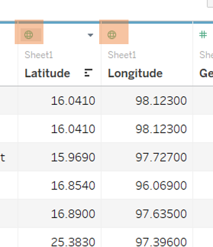
```

4. Drag the *longitude* and *latitude* fields on to the column and row shelves respectively. 

```{r, fig.align="center",echo=FALSE, out.width="100%", fig.cap="Creating the map"}
knitr::include_graphics("step2.png")
```

5. Drag *Event Type* and *Event Id Cnty* to the Marks card.

```{r, fig.align="center",echo=FALSE, out.width="100%", fig.cap="Plotting the points"}
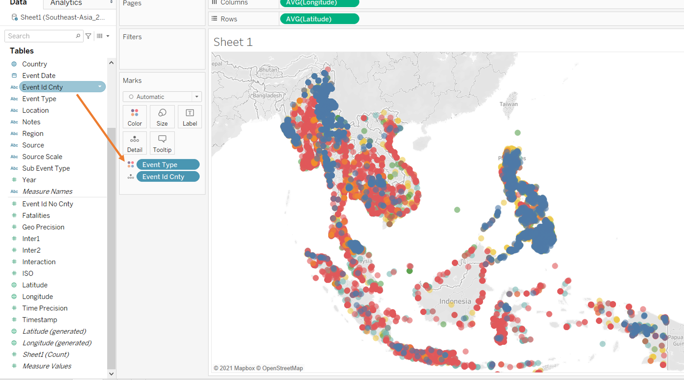
```

6. Drag *Fatalities* to the size and make the measure a *SUM*. Increase the size of the marks

```{r, fig.align="center",echo=FALSE, out.width="100%", fig.cap="Scaling the size of points by fatalities"}
knitr::include_graphics("step4.png")
```


7. Change the range of the size legend from *0 - 243* to *0 - 250* to have consistent ranges.

```{r, fig.align="center",echo=FALSE, out.width="100%", fig.cap="Creating a consistent legend"}
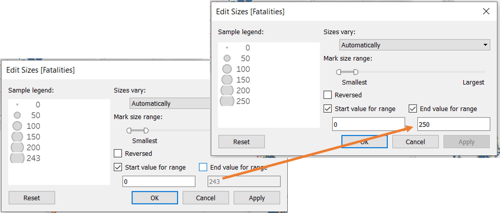
```

8. Rename the title of the size legend from *SUM(Fatalities)* to *Number of Fatalities*

9. Decrease the opacity of the circles in the colour menu from 100% to 50% to allow overlapping points to show. 

```{r, fig.align="center",echo=FALSE, fig.width=50, fig.height=100, fig.cap="Making the circles partially transparent"}
knitr::include_graphics("step6.png")
```

10. Drag the *Event Date* on to the filter pane. Select *Years* as filter method and select all for filtering. 

```{r, fig.align="center",echo=FALSE, fig.width=50, fig.height=100, fig.cap="Creating a Year filter for events"}
knitr::include_graphics("step7.png")
```

11. Drag *Country* on to the filter pane. Select all countries for filtering. 

12. Drag *Event Type* on to the filter pane. Select all types for filtering. 

13. Drag *Sub Event Type* on to the filter pane. Select all types for filtering. 

14. Drag *Admin1* on to the filter pane. Select all types for filtering. 

```{r, fig.align="center",echo=FALSE, out.width="100%", fig.cap="Adding all the other filters"}
knitr::include_graphics("step8.png")
```

15. Show the *Country*, *Admin1*, *Event Type* and *Sub Event Type* filters . Change filter type to *Multiple Values (Dropdown)* in order to better manage space in the dashboard.

```{r, fig.align="center",echo=FALSE, out.width="100%", fig.cap="Showing and decluttering the filters created"}
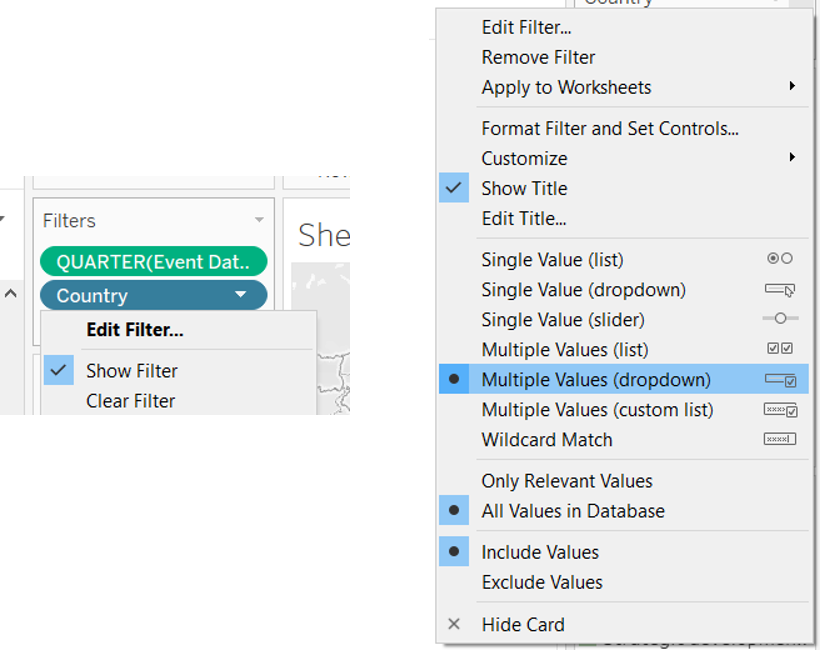
```

16. For *Admin1*, change the display criteria to *'Only Relevant Values'*. This will make it only show data points relevant to the selection of other filters. e.g. only show *Admin1* values relevant to *Cambodia* when *country* is filtered by *Cambodia*.

```{r, fig.align="center",echo=FALSE, out.width="100%", fig.cap="Adding the State filter and only showing values to selected country"}
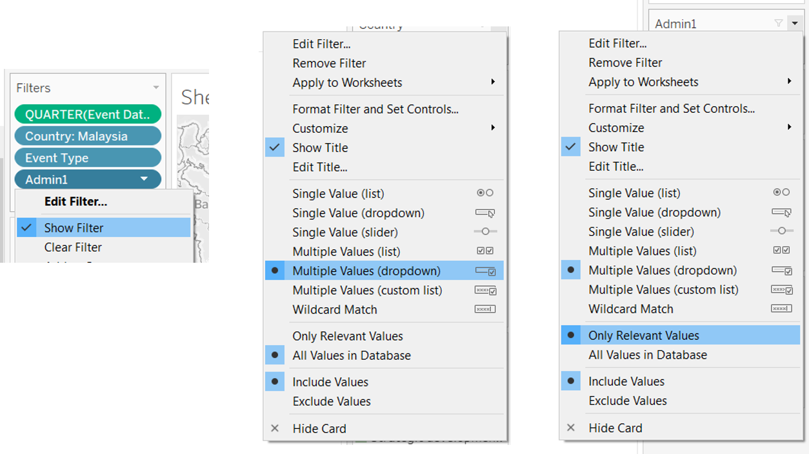
```


17. Rename the filter *Admin1* to *State*

18. Show the *YEAR (Event Date)* filter. 

```{r, fig.align="center",echo=FALSE, fig.width=60, fig.height=100, fig.cap="Exposing filters to users"}
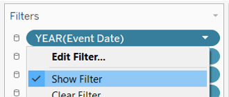
```

19. Include *Sub Event Type, Actor 1, Assoc Actor 1, Actor 2, Assoc Actor 2* into the tooltips

```{r, fig.align="center",echo=FALSE, fig.width=60, fig.height=100, fig.cap="Adding more information into tooltips"}
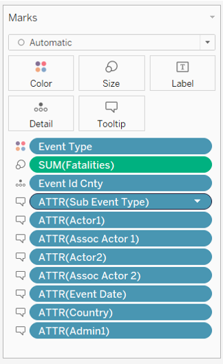
```

20. Reformat the tooltip into two distinct parts 'Event Details' and 'Involved Parties'

```{r, fig.align="center",echo=FALSE, out.width="100%", fig.cap="Reformatting the tooltips"}
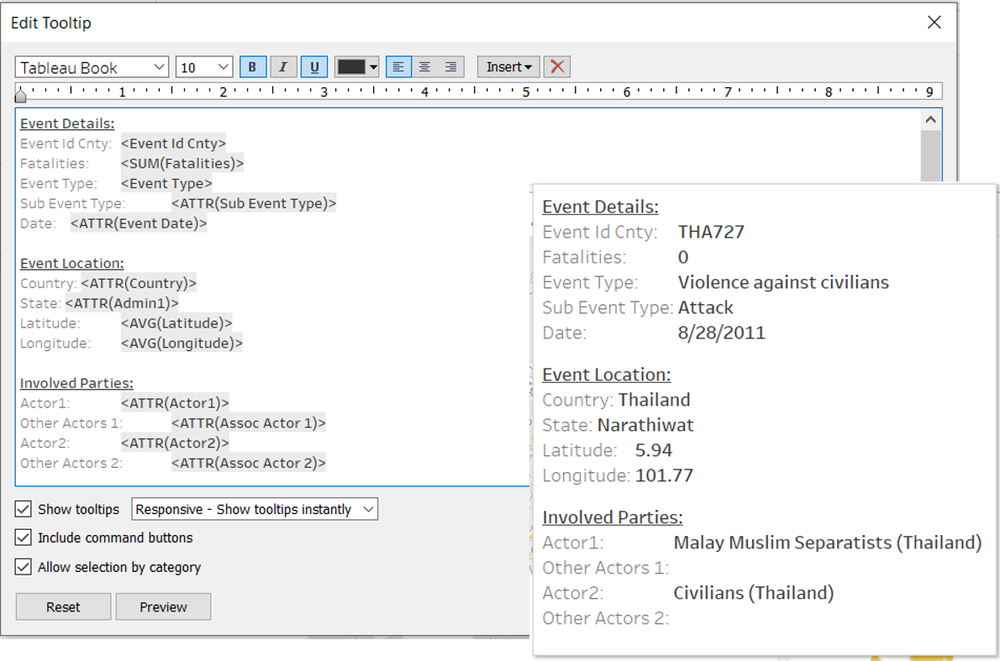
```

21. Rename the visualization to *Armed Conflict Location & Event in < Country>, <YEAR(Event Date)>*

```{r, fig.align="center",echo=FALSE, out.width="100%", fig.cap="Renaming the visualization"}
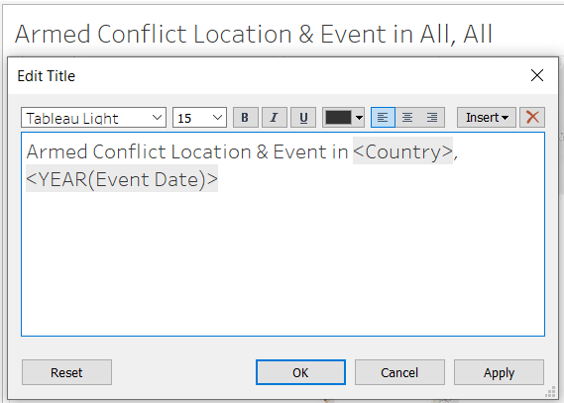
```

### 3.2 Steps taken for second visualization (Line Graph)

22. Create a new sheet. 

23. Drag *Sheet1(COUNT)* to the rows shelf

```{r, fig.align="center",echo=FALSE, out.width="100%", fig.cap="Populating the graph"}
knitr::include_graphics("step15.png")
```

24. Drag *event type* on to colour on the marks card.

```{r, fig.align="center",echo=FALSE, out.width="100%", fig.cap="Color coding the graph"}
knitr::include_graphics("step16.png")
```

25. Drag *Year* to the columns shelf

```{r, fig.align="center",echo=FALSE, out.width="100%", fig.cap="Plotting the line plots against year"}
knitr::include_graphics("step17.png")
```

26. Rename vertical axis as *Number of Events*

27. Create a new sheet *Event Count Tooltip*

28. Drag *Sheet1(COUNT)* to the columns shelf and the marks card. 

29. Drag *Country* to the rows shelf

```{r, fig.align="center",echo=FALSE, out.width="100%", fig.cap="Populating the data points for the tooltip"}
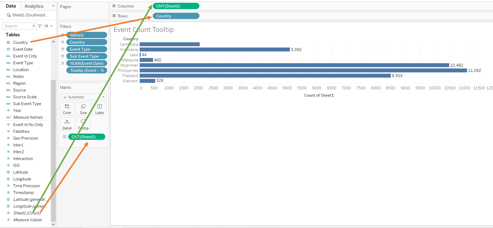
```

30. Rename the horizontal axis as *Number of Events*

```{r, fig.align="center",echo=FALSE, fig.width=60, fig.height=100, fig.cap="Renaming the axis"}
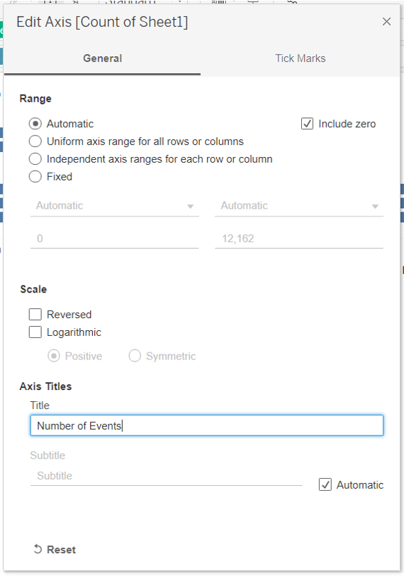
```

31. Add in sheet as tooltip in the original visualization. Tooltip will show breakdown of event counts by country for each given event type. 

```{r, fig.align="center",echo=FALSE, out.width="100%", fig.cap="How the tooltip and formatting looks like"}
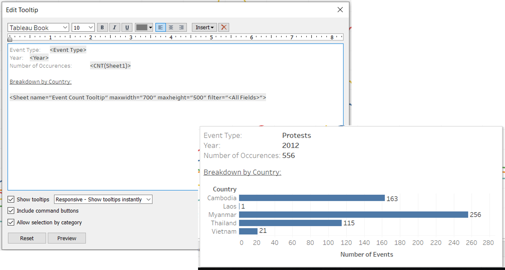
```

32. Rename chart as *Event Count*

```{r, fig.align="center",echo=FALSE, out.width="100%", fig.cap="Renaming the chart"}
knitr::include_graphics("step21.png")
```

### 3.3 Steps taken for third visualization (Line Graph)

33. Duplicate the previous sheet for event counts. 

```{r, fig.align="center",echo=FALSE, fig.width=50, fig.height=100, fig.cap="Duplicating the previous visualization"}
knitr::include_graphics("step22.png")
```

34. Replace *Sheet1(COUNT)* with *SUM(Fatalities)* on the rows shelf

```{r, fig.align="center",echo=FALSE, out.width="100%", fig.cap="Replacing attributes: Count of events with sum of fatalities"}
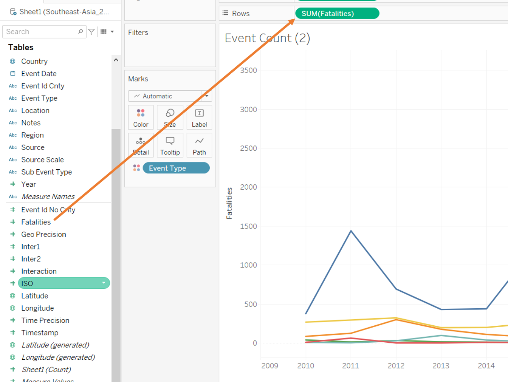
```

35. Rename vertical axis as *Fatalities'* and change to logarithmic to prevent the graph from being distorted

```{r, fig.align="center",echo=FALSE, fig.width=60, fig.height=100, fig.cap="Renaming the axis and changing the scale to log"}
knitr::include_graphics("step24.png")
```

36. Create a new sheet.

37. Drag *Fatalities* to the columns shelf and the marks card and Drag *Country* to the rows shelf

```{r, fig.align="center",echo=FALSE, out.width="100%", fig.cap="Creating a second visual tooltip"}
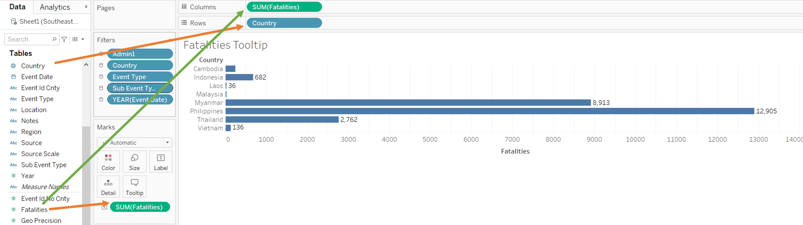
```

38. Add in sheet as tooltip in the original visualization. Tooltip will show breakdown of fatalities by country for each given event type.

```{r, fig.align="center",echo=FALSE, out.width="100%", fig.cap="How the tooltip and formatting looks like"}
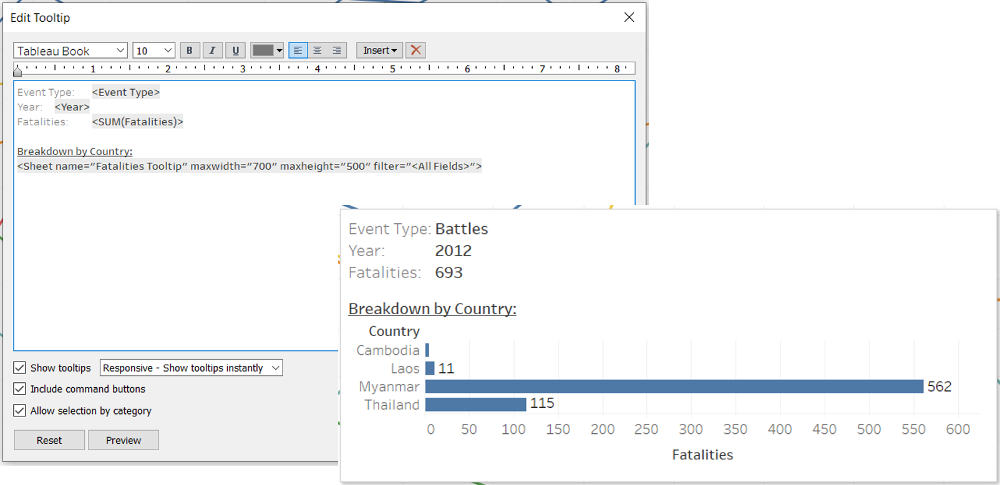
```

39. Rename chart as *Number of Fatalities*

```{r, fig.align="center",echo=FALSE, out.width="100%", fig.cap="Renaming the chart"}
knitr::include_graphics("step27.png")
```


### 3.4 Steps taken for fourth visualization (Data Table)

40. Drag *Sheet1(COUNT)* to text on the marks card

```{r, fig.align="center",echo=FALSE, out.width="100%", fig.cap="Creating a data table"}
knitr::include_graphics("step28.png")
```

41. Drag *country* to the rows shelf

```{r, fig.align="center",echo=FALSE, out.width="100%", fig.cap="Breaking down the data table by country"}
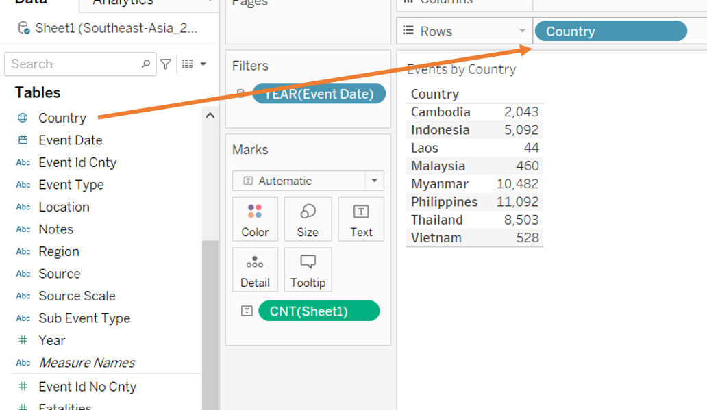
```

42. Rename visualization to *Events by Country*

```{r, fig.align="center",echo=FALSE, out.width="100%", fig.cap="Renaming the chart"}
knitr::include_graphics("step30.png")
```

43. Hide field labels for rows

```{r, fig.align="center",echo=FALSE, fig.width=80, fig.height=100, fig.cap="Removing redundant field label"}
knitr::include_graphics("step31.png")
```

### 3.5 Steps taken to create dashboard

44. Create new dashboard tab

45. Change the size of the dashboard from fixed to automatic

```{r, fig.align="center",echo=FALSE, fig.width=80, fig.height=100, fig.cap="Changing dashboard size setting"}
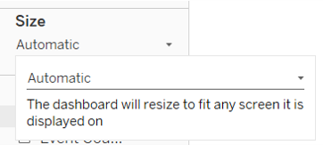
```

46. Drag the map on to the dashboard 

```{r, fig.align="center",layout='l-page',echo=FALSE, out.width="100%", fig.cap="Putting the map visual on the dashboard"}
knitr::include_graphics("step33.png")
```

47. Drag the event count visualization to the right of the map

```{r, fig.align="center",layout='l-page',echo=FALSE, out.width="100%", fig.cap="Putting the event count visual on the dashboard"}
knitr::include_graphics("step34.png")
```

48. Place the fatalities visualization to the bottom of the event count visualization

```{r, fig.align="center",layout='l-page',echo=FALSE, out.width="100%", fig.cap="Putting the fatalities visual on the dashboard"}
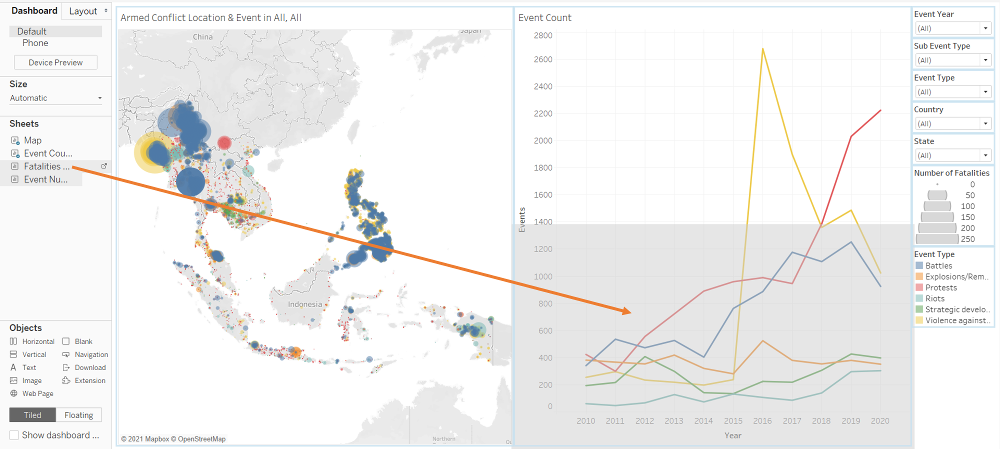
```

49. Drag the events by country data table to the bottom right corner.

```{r, fig.align="center",layout='l-page',echo=FALSE, out.width="100%", fig.cap="Putting the event count data table on the dashboard"}
knitr::include_graphics("step36.png")
```

50. Synchronize filters to apply across all visualizations

```{r, fig.align="center",echo=FALSE, fig.width=80, fig.height=100, fig.cap="Changing filters to apply across all visuals"}
knitr::include_graphics("step37.png")
```

51. Dashboard is complete.

# 4 - The improved data visualization

The completed visualization is as follows.

```{r, fig.align="center",layout='l-page',echo=FALSE, out.width="100%", fig.cap="The Completed dashboard"}
knitr::include_graphics("final.png")
```

```{r, fig.align="center",layout='l-page',echo=FALSE, out.width="100%", fig.cap="The Completed dashboard with a visual tooltip on fatalities displayed"}
knitr::include_graphics("final1.png")
```

```{r, fig.align="center",layout='l-page',echo=FALSE, out.width="100%", fig.cap="The Completed dashboard with a visual tooltip on event count displayed"}
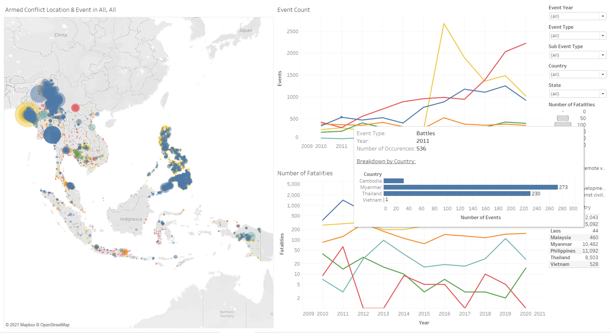
```

The interactive dashboard is uploaded onto Tableau Public Server and can be found [here](https://public.tableau.com/views/ArmedConflictLocationandEventDashboard/Dashboard?:language=en&:display_count=y&publish=yes&:origin=viz_share_link).

# 5 - New Insights

## 5.1 asd

## 5.2 asd

## 5.3 asda

## 5.4 asf

## 5.5 dfaa